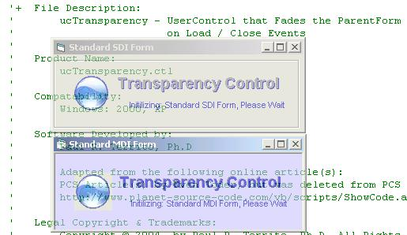



## Transparency Control \(Update\)

### Description

Need a transparency fading effect for both SDI and MDI Forms? Want the control to be drop in place, lightweight (~10kb), provide Load/Unload event subclassing, and allow splash form sleeping? This simple Transparency Control does this and more...Just drop the control on the form, set the properties and that is it…No additional coding!
 
### More Info
 

             |
---                |---
**Submitted On**   |2005-04-05 22:50:42
**By**             |[TerriTop](https://github.com/Planet-Source-Code/PSCIndex/blob/master/ByAuthor/territop.md)
**Level**          |Beginner
**User Rating**    |4.8 (29 globes from 6 users)
**Compatibility**  |VB 4\.0 \(32\-bit\), VB 5\.0, VB 6\.0, VB Script, VBA MS Access, VBA MS Excel
**Category**       |[Custom Controls/ Forms/  Menus](https://github.com/Planet-Source-Code/PSCIndex/blob/master/ByCategory/custom-controls-forms-menus__1-4.md)
**World**          |[Visual Basic](https://github.com/Planet-Source-Code/PSCIndex/blob/master/ByWorld/visual-basic.md)
**Archive File**   |[Transparen187263452005\.zip](https://github.com/Planet-Source-Code/territop-transparency-control-update__1-59846/archive/master.zip)

